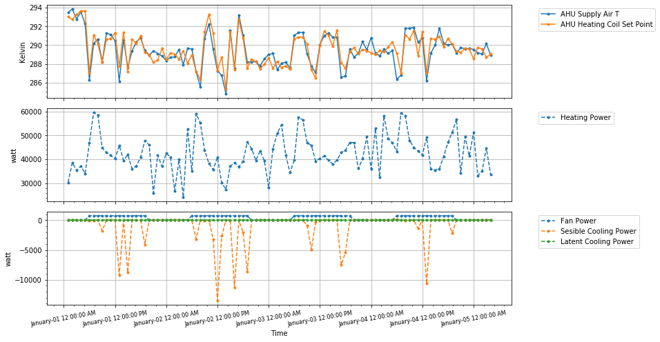

# 5 Zone Test Bed Control
This repository can be used to demonstrate how a standard reinforcement learning agent repecting the OpenAI Gym protocol can interact with a [Modelica Buildings Library](https://github.com/lbl-srg/modelica-buildings) FMU model in "Co-Simulation" mode for the purposes of performing reinforcement learning based control on the FMU.

The base testbed class called `testbed_base` implements some of the lower level functionalities following the OpenAI Gym method of creating an environment. These are the following

`__init__` : used to pass the `names` and `gym space` type of the variables used as observations and actions for the process. IT also needs the path to the complied `fmu` model and the path to the json file containing all the `fmu variables`.

`re_init` : To enable resetting the fmu model to its initial state without creating a new instance.

`reset` : To allow the reinforcement learning agent to reset the environment to start a new learning or testing episode.

`step` : Used to perform a step of the simulation based on actions sent by the agent to this method. It performs the following methods:

* `action_processor` : Abstract method used to process the action sent by the rl controller.
* `obs_processor` :  Abstract method used to process the observation to be sent to the rl controller.
* `state_transition` : Perform a step of the simulation based on the processed action and return the next state.
* `calculate_reward_and_info` : Calculate step reward based on current state, action, next_state.
* `check_done` : Return True of condition for episode end is met.
`load_fmu` : Load the compiled fmu from a given path.

All these methods can be overridden by any class inheriting from this based environment.

## Example

We created a simple testbed `testbed_v0` where we use `ambient temperature, humidity, solar radiation, ahu supply air temperature` as observation variables. `ahu heating coil setpoint` as the action variable. The `fmu` is compiled using the 5 Zone VAV Reheat Example created by [Modelica Buildings Library](https://github.com/lbl-srg/modelica-buildings) and modified by us to declare certain variables as inputs. The modified file is hosted [here](https://github.com/AvisekNaug/buildings_library_dev/blob/master/Buildings/Examples/VAVReheat/RLPPOV1.mo) The reward is the negative of the total energy consumed over a step duration of unit time/power consumed. Other methods for model checking, variable checking are also provided. 

A complete description of all possible variables that can be treated as part of the observation space or action space is provided [here](https://github.com/AvisekNaug/5ZoneTestBedControl/blob/master/RLPPOV1_get_model_variables.json).

# Requirements
* Compiled FMU - We are using fmus compiled in Jmodelica
* Python requirements: `gym`, `pyfmi`, any reinforcement learning module that respects OpenAI gym methods for training and testing.